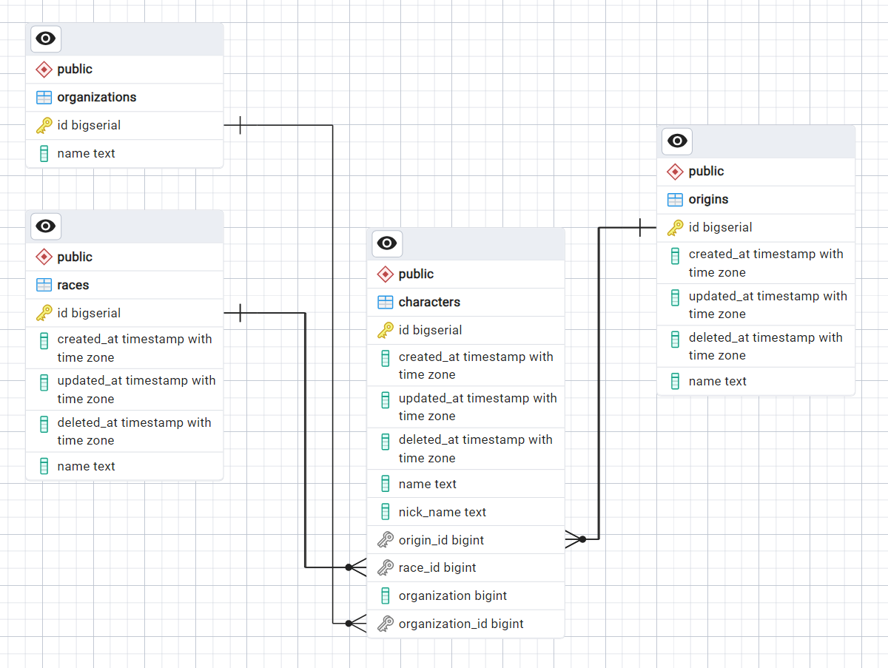

# One Piece Characters Web Service

---

---


## Description
This project is a web service built using Go (Golang) that runs locally on localhost. It provides endpoints for GET, POST, and PUT methods to interact with a PostgreSQL database. The focus of this project is to manage data related to characters from the popular manga and anime series, One Piece.

## Features
- **GET Method**: Retrieves information about One Piece characters from the database.
- **POST Method**: Adds new characters to the database.
- **PUT Method**: Updates existing character information in the database.
- **PostgreSQL Database**: Utilizes PostgreSQL to store and manage character data.

## Installation
1. Clone this repository to your local machine.
   ```
   git clone https://github.com/justkurama/GO-onepiece.git
   ```
2. Install dependencies.
   ```
   go mod download
   ```
3. Ensure PostgreSQL is installed and running on your system.
4. Update the database configuration in `db.go` with your PostgreSQL credentials.
5. Build and run the project.
   ```
   go build
   ./GO-onepiece
   ```

## Database Schema



### Character Table
- Description: Stores information about One Piece characters.
- Columns:
  - **ID**: Unique identifier for the character (Primary Key)
  - **Name**: Full name of the character
  - **NickName**: Nickname of the character
  - **Origin**: Foreign key referencing the `Origin` table
  - **Race**: Foreign key referencing the `Races` table
  - **Organization**: Foreign key referencing the `Organization` table

### Origin Table
- Description: Stores information about the origin of characters.
- Columns:
  - **ID**: Unique identifier for the origin (Primary Key)
  - **Name**: Name of the origin

### Races Table
- Description: Stores information about the races of characters.
- Columns:
  - **ID**: Unique identifier for the race (Primary Key)
  - **Name**: Name of the race

### Organization Table
- Description: Stores information about organizations characters belong to.
- Columns:
  - **ID**: Unique identifier for the organization (Primary Key)
  - **Name**: Name of the organization

## Endpoints

### GET /characters
- Description: Retrieves information about all One Piece characters.
- Example Response:
  ```
  [
    
    {
        "ID": 1,
        "Name": "Monkey D. Luffy",
        "NickName": "Mugiwara",
        "Origin": {
            "ID": 1,
            "Name": "East Blue"
        },
        "Race": {
            "ID": 1,
            "Name": "Human"
        },
        "Organization": {
            "ID": 1,
            "Name": "Pirate"
        }
    },
    {
        "ID": 2,
        "Name": "Koby",
        "NickName": "Hero",
        "Origin": {
            "ID": 1,
            "Name": "East Blue"
        },
        "Race": {
            "ID": 1,
            "Name": "Human"
        },
        "Organization": {
            "ID": 2,
            "Name": "Marine"
        }
    }
    ...
  ]
  ```

### POST /character
- Description: Adds a new character to the database.
- Payload:
  ```
  {
    "name": "Nami",
    "nickname": "Cat Burglar",
    "origin": 1,
    "race": 1,
    "organization": 1
  }
  ```

### PUT /character/{id}
- Description: Updates information about a specific character.
- Example Request:
  ```
  PUT /character/2
  {
    "nickname": "Marine Hero"
  }
  ```

## About team
- Name: Straw Hats
- Members: Kurmanbek(22B030597) and Dias(22B031174)

## Contributing
Contributions are welcome! If you want to contribute to this project, please fork the repository and submit a pull request with your changes.

