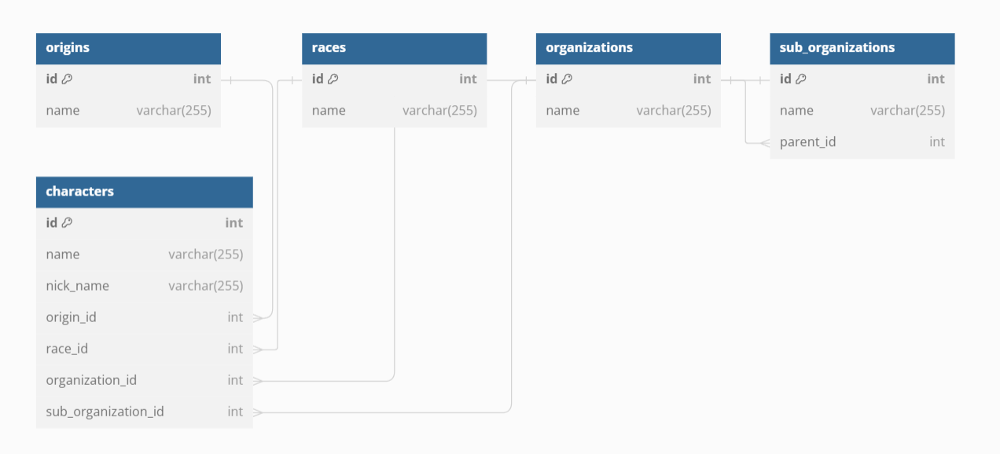

# One Piece Characters Web Service

---

---


## Description
This project is a web service built using Go (Golang) that runs locally on localhost. It provides endpoints for GET, POST, PUT, and DELETE methods to interact with a PostgreSQL database. The focus of this project is to manage data related to characters from the popular manga and anime series, One Piece.

## Features
- **GET Method**: Retrieves information about One Piece characters from the database.
- **POST Method**: Adds new characters to the database.
- **PUT Method**: Updates existing character information in the database.
- **DELETE Method**: Delete existing character information in the database.
- **PostgreSQL Database**: Utilizes PostgreSQL to store and manage character data.

## Installation
1. Clone this repository to your local machine.
   ```
   git clone https://github.com/justkurama/GO-onepiece.git
   ```
2. Install dependencies.
   ```
   go mod download
   ```
3. Ensure PostgreSQL is installed and running on your system.
4. Update the database configuration in `db.go` with your PostgreSQL credentials.
5. Build and run the project.
   ```
   go build
   ./GO-onepiece
   ```

## Database Schema



# Database Models

This application uses GORM to manage its database models. Below are the details of the models used in this project.

## Models

### Character

The `Character` model represents a character in the database.

| Field              | Type     | Description                    |
|--------------------|----------|--------------------------------|
| ID                 | uint     | Primary key                    |
| Name               | string   | The name of the character      |
| NickName           | string   | The nickname of the character  |
| Origin             | Origin   | Associated origin              |
| OriginID           | uint     | Foreign key to Origin          |
| Race               | Race     | Associated race                |
| RaceID             | uint     | Foreign key to Race            |
| Organization       | Organization | Associated organization     |
| OrganizationID     | uint     | Foreign key to Organization    |
| SubOrganization    | SubOrganization | Associated sub-organization |
| SubOrganizationID  | uint     | Foreign key to SubOrganization |

### Origin

The `Origin` model represents the origin or birthplace of a character.

| Field       | Type           | Description                           |
|-------------|----------------|---------------------------------------|
| ID          | uint           | Primary key                           |
| Name        | string         | The name of the origin                |
| Characters  | []Character    | List of characters from this origin   |

### Race

The `Race` model represents the race or species of a character.

| Field       | Type           | Description                           |
|-------------|----------------|---------------------------------------|
| ID          | uint           | Primary key                           |
| Name        | string         | The name of the race                  |
| Characters  | []Character    | List of characters of this race       |

### Organization

The `Organization` model represents an organization to which a character may belong.

| Field              | Type              | Description                            |
|--------------------|-------------------|----------------------------------------|
| ID                 | uint              | Primary key                            |
| Name               | string            | The name of the organization           |
| Characters         | []Character       | List of characters in this organization|
| SubOrganizations   | []SubOrganization | List of sub-organizations under this organization |

### SubOrganization

The `SubOrganization` model represents a sub-organization that belongs to an organization.

| Field       | Type            | Description                                      |
|-------------|-----------------|--------------------------------------------------|
| ID          | uint            | Primary key                                      |
| Name        | string          | The name of the sub-organization                 |
| ParentID    | uint            | Foreign key to the parent organization           |
| Parent      | Organization    | The parent organization to which it belongs      |

## Relationships

- A `Character` belongs to an `Origin`, `Race`, `Organization`, and `SubOrganization`.
- An `Origin` can have many `Characters`.
- A `Race` can have many `Characters`.
- An `Organization` can have many `Characters` and many `SubOrganizations`.
- A `SubOrganization` belongs to an `Organization`.

This structure ensures the proper associations between entities and facilitates the management of relationships using GORM.

## Endpoints

### GET /characters
- Description: Retrieves information about all One Piece characters.
- Example Response:
  ```
  [
    
    {
        "ID": 1,
        "Name": "Monkey D. Luffy",
        "NickName": "Mugiwara",
        "Origin": {
            "ID": 1,
            "Name": "East Blue"
        },
        "Race": {
            "ID": 1,
            "Name": "Human"
        },
        "Organization": {
            "ID": 1,
            "Name": "Pirate"
        }
    },
    {
        "ID": 2,
        "Name": "Koby",
        "NickName": "Hero",
        "Origin": {
            "ID": 1,
            "Name": "East Blue"
        },
        "Race": {
            "ID": 1,
            "Name": "Human"
        },
        "Organization": {
            "ID": 2,
            "Name": "Marine"
        }
    }
    ...
  ]
  ```

### POST /character
- Description: Adds a new character to the database.
- Payload:
  ```
  {
    "name": "Nami",
    "nickname": "Cat Burglar",
    "origin": 1,
    "race": 1,
    "organization": 1
  }
  ```

### PUT /character/{id}
- Description: Updates information about a specific character.
- Example Request:
  ```
  PUT /character/2
  {
    "nickname": "Marine Hero"
  }
  ```

## About team
- Name: Straw Hats
- Members: Kurmanbek(22B030597) and Dias(22B031174)

## Contributing
Contributions are welcome! If you want to contribute to this project, please fork the repository and submit a pull request with your changes.

